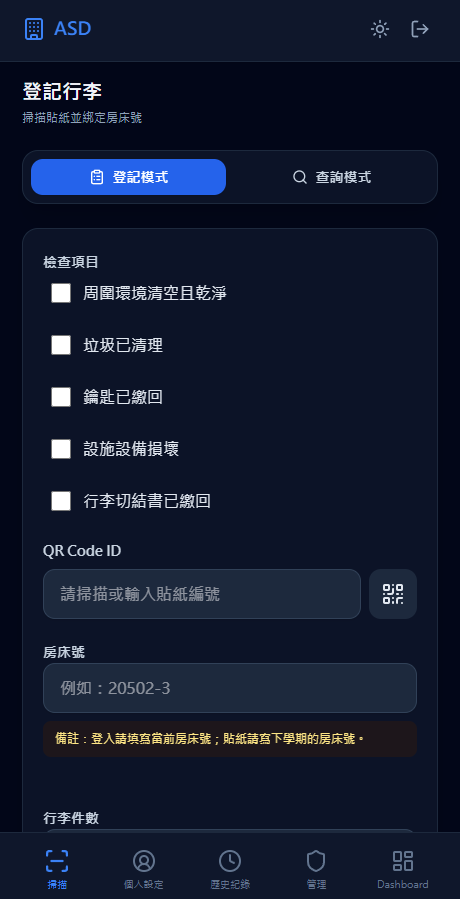
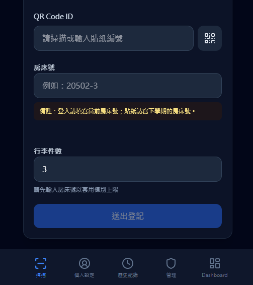
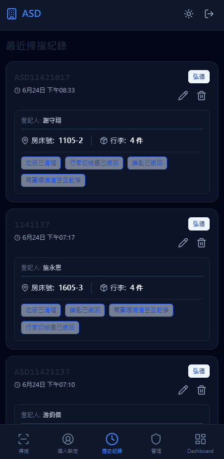
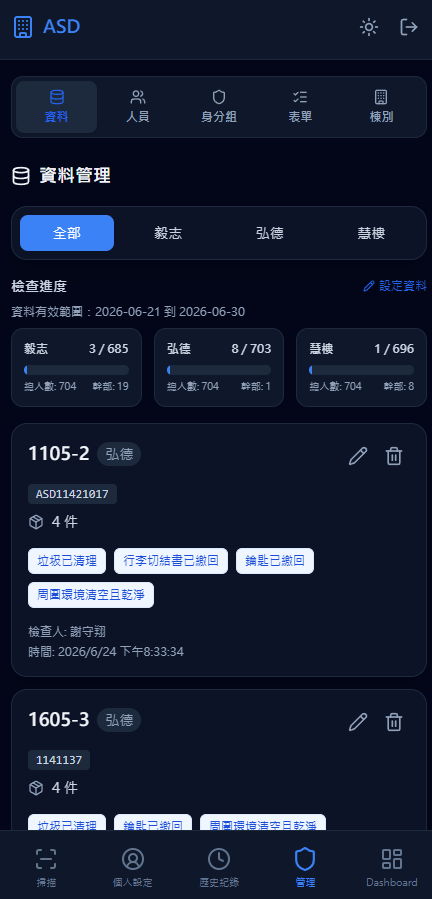
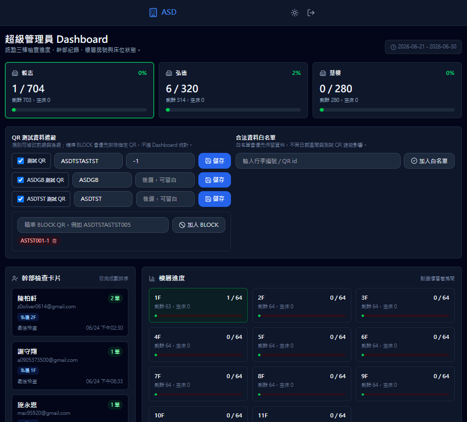
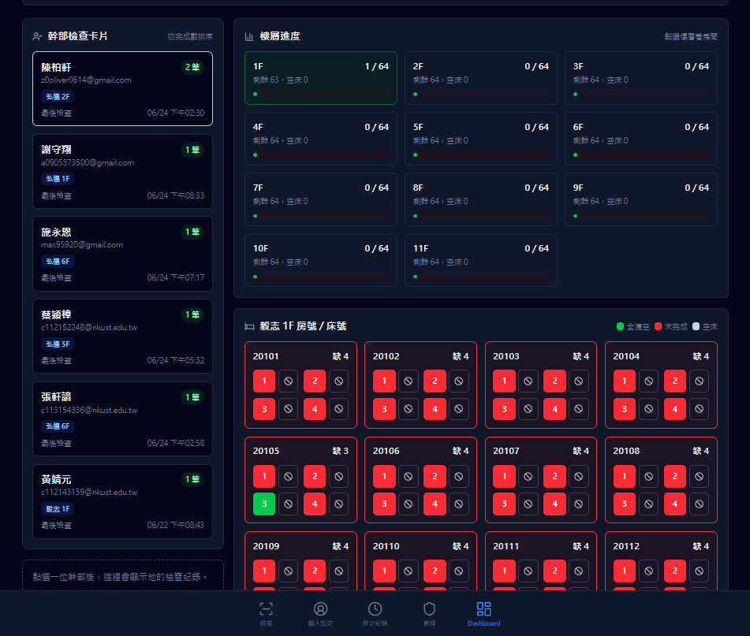

# ASD 行李貼紙管理 App

這是一套給工作人員使用的行李貼紙管理 Web App。系統透過 Google 登入控管使用者，讓工作人員可以掃描或輸入行李貼紙 QR Code，將貼紙與房床號、棧別、行李件數和檢查項目綁定，並把資料同步到 Firebase Firestore。

App 目前部署在 Firebase Hosting：

- https://asd-jg.web.app

## 主要功能

- Google 登入與使用者審核流程
- 行李貼紙 QR Code 掃描、手動輸入與暫存清單
- 房床號自動辨識棧別，並套用各棧行李件數上限
- 登記前 Double Check 確認視窗，降低現場誤登記
- 重複 QR Code / 房床號提醒，避免有效資料範圍內重複建檔
- 行李資料查詢，可用貼紙 QR Code 查最新登記紀錄
- 個人與管理員歷史紀錄頁，可檢視與調整行李件數
- 管理後台，可管理使用者、身分組、檢查表單、棧別設定與行李資料
- Dashboard，可彙整各棟、樓層、房床與工作人員的檢查進度
- QR 測試資料遮蔽、白名單與資料有效日期區間設定

## 使用情境

現場工作人員登入後進入「登記行李」頁面，掃描貼紙 QR Code，輸入當前房床號與行李件數，確認資料後送出登記。系統會依房床號判斷棧別，並在送出前提示可能重複的 QR Code 或房床號。

SCAN 頁面目前也提醒現場規則：

- 登入請填寫當前房床號
- 貼紙請寫下學期的房床號

管理員可以在後台調整使用者權限、行李資料、檢查項目與棧別設定；具有 Dashboard 權限的使用者可查看整體檢查進度與未完成房床。

## 畫面截圖

### 掃描與登記




### 歷史紀錄



### 管理後台



### Dashboard




## 技術架構

- Frontend: React 19 + TypeScript + Vite
- Styling: Tailwind CSS utilities
- Auth: Firebase Authentication with Google sign-in
- Database: Firebase Firestore
- Hosting: Firebase Hosting
- QR scanner: `html5-qrcode`
- Icons: `lucide-react`
- Tests: Node.js built-in test runner

## 專案結構

```text
src/
  App.tsx                     # 路由與登入權限保護
  firebase.ts                 # Firebase Auth / Firestore 初始化
  hooks/useAuth.tsx           # 登入狀態、使用者資料與審核狀態
  components/Layout.tsx       # App 外框、導覽列與深色模式
  pages/
    Login.tsx                 # Google 登入頁
    SetupProfile.tsx          # 初次登入資料填寫
    PendingApproval.tsx       # 等待審核頁
    Scan.tsx                  # 行李登記與 QR 查詢
    History.tsx               # 歷史紀錄
    Admin.tsx                 # 管理後台入口
    SuperAdminDashboard.tsx   # 檢查進度 Dashboard
    admin/                    # 使用者、角色、行李、表單與棧別管理
  services/                   # Firestore 設定與權限資料存取
  utils/                      # Dashboard、房床、篩選與版本工具
tests/                        # Node.js test runner 測試
```

## 本機開發

安裝依賴：

```powershell
npm.cmd install
```

啟動開發伺服器：

```powershell
npm.cmd run dev
```

預設開發網址：

```text
http://127.0.0.1:5173
```

## 測試與建置

執行測試：

```powershell
node --test tests\*.test.ts
```

建置正式版：

```powershell
npm.cmd run build
```

建置輸出會產生在 `dist/`，並由 Firebase Hosting 發布。

## 部署

只部署 Hosting：

```powershell
npx.cmd firebase-tools deploy --only hosting --project asd-jg
```

預設 Firebase project 設定在 `.firebaserc`，目前為 `asd-jg`。部署時只使用 `--only hosting`，避免未經確認地同步 Firestore rules 或 indexes。
